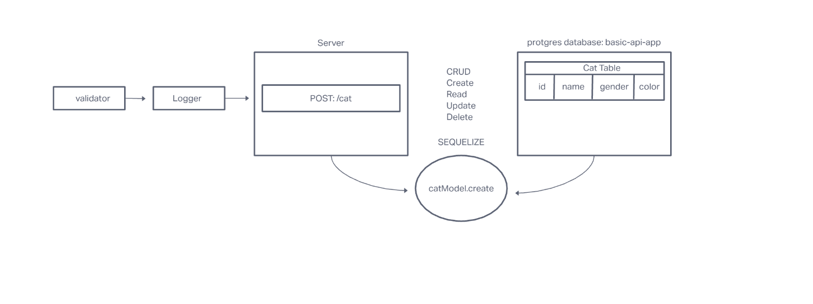

# Project: basic-api-server

## Deployment Test
### Author: Allie Dunkel

### Problem Domain
Build a REST API using Express, by creating a proper series of endpoints that perform CRUD operations on a database, using the REST standard

Dynamic API Phase 2: Perform CRUD Operations on a database

### Setup
.env requirements
PORT - 3001

### Running the app
npm start

### Tests
Unit Tests: npm run test

Lint Tests: npm run lint

### UML

